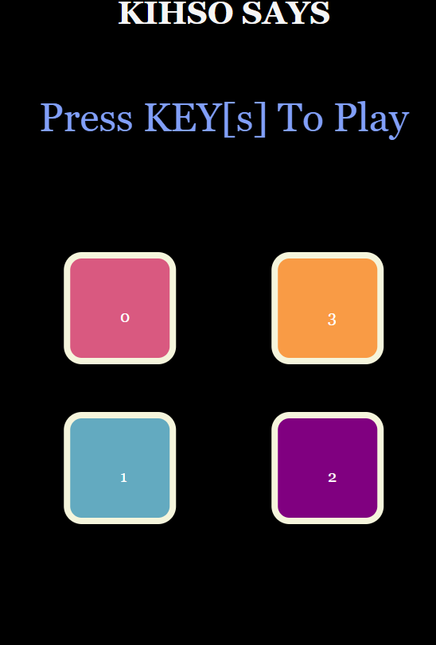

# 🎨 Find Color Game – A Fun Simon Says Challenge!  

Find Color Game is an interactive **Simon Says-style** game that tests your memory and reflexes. Follow the pattern of colors, repeat them correctly, and see how far you can go!  

## 🚀 Features  
✅ **Challenging Gameplay** – Repeat the correct color sequence as it gets harder  
✅ **Multiple Difficulty Levels** – Start easy and work your way up!  
✅ **Cool Animations & Sound Effects** – Engaging visuals and audio feedback  
✅ **Responsive Design** – Play on desktop and mobile  

## 🛠 Technologies Used  
- **Frontend:** HTML, CSS, JavaScript  
- **(Optional) Sound Effects:** Web Audio API  

## 📦 Installation & Usage  
📷 Screenshots

🎮 Game Interface
🔴🟡🟢🔵 Color Flashing Sequence


### 1️⃣ Clone the Repository  
```sh
git clone https://github.com/KIHs0/find-color-game.git

